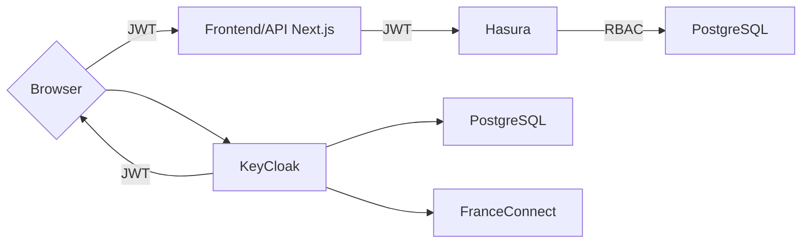

# template


Template minimal de la [Fabrique des ministères sociaux](https://www.fabrique.social.gouv.fr/) qui intègre nos [recommandations tech](https://socialgouv.github.io/support/docs/standards/developpement).

> ⚠️ Le [Système de Design de l'État](https://www.systeme-de-design.gouv.fr/) s'adresse **uniquement** aux développeurs et aux concepteurs, qu'ils soient agents publics ou prestataires pour des sites Internet de l'État (Ministères, Administrations centrales, Préfectures, Ambassades, etc.)

## Description

- 🇫🇷 Basé sur [codegouv/react-dsfr](https://github.com/codegouvfr/react-dsfr)
- ⚖️ Pages de "conformité" (CGU, RGPD, stats..)
- 📦 Testing, lint, CI & release automatisés
- 🔒 Image docker `rootless`, [header CSP](https://developer.mozilla.org/en-US/docs/Web/HTTP/CSP)
- 🔑 prévention de fuite de secrets avec [talisman](https://github.com/thoughtworks/talisman/)
- 📊 Intégration de sentry & matomo
- ⚡️ Basé sur [Next](https://nextjs.org/) et TypeScript

## Dans le détail

### D'un point de vue fonctionnel

- Page principale
- Politique de confidentialité
- Mentions légales
- Conditions générales d'utilisation
- Statistiques d'utilisation (fonctionnant avec matomo)
- Déclaration d'accessibilité
- Healthz
- Page 404

#### En plus dans la branche `hasura` :

- Page d'authentification
- Page d'inscription
- Page profil
- Interactions avec la base de données

### D'un point de vue technique

- [storybook](https://storybook.js.org/) permettant de réaliser des stories pour les composants
- [@testing-library](https://testing-library.com/) pour tester de manière unitaire les composants
- [jest](https://jestjs.io/) pour tester de manière unitaire le code
- [cypress](https://www.cypress.io/) pour tester en e2e le frontend
- [talisman](https://github.com/thoughtworks/talisman/) qui permet de prévenir la publication de secrets dans votre code
- un [Dockerfile](./Dockerfile) rootless de production basé sur nginx
- des [Content Security Policy et headers de sécurité de base](https://developer.mozilla.org/fr/docs/Web/HTTP/CSP)

- Côté Next.js:
  - intégration de [@codegouvfr/react-dsfr](https://github.com/codegouvfr/react-dsfr/) pour le [design système de l'état](https://www.systeme-de-design.gouv.fr/)
  - intégration de [sentry](https://sentry.io/) pour gérer les erreurs
  - intégration de [matomo](https://matomo.org/) pour les statistiques d'utilisation

#### En plus dans la branche `hasura` :

- [keycloak](https://www.keycloak.org/) qui est un serveur d'authentification (exclusive à `main`)
- [next-auth](https://next-auth.js.org/) qui est un wrapper pour gérer l'authentification au sein de l'application (exclusive à `main`)
- [hasura](https://hasura.io) qui permet d'exposer une API GraphQL sur votre Postgres et de gérer les authorisations (RBAC)

## Lancer le code

Après avoir cloné le projet :

### Développement

:warning: Avant de lancer le projet, vous devez installer `gomplate`

```bash
yarn # to install dependencies
yarn dev # to run in dev mode
```

### Gestion des environnements

Les variables issues des docker build-args, sont à utiliser dans `next.config.js`, pour les autres, il faut les définir dans les différents [`.env.*`](https://nextjs.org/docs/basic-features/environment-variables#environment-variable-load-order).

Le fichier `.env.staging` est utilisé pour les environnements de review et de pré-production.

Le fichier `.env.development` est utilisé pour l'environnement de développement.

:warning: Les variables d'environnement sont publiques (utilisées durant le build), ne commitez donc pas de variables privées dans ces fichiers.

#### Variables d'env

cf .env.development

en production, les secrets sont chiffrés dans GIT avec sealed-secrets.

### Branche `Hasura`

Cette branche propose des composants backends de référence.

---



---

Lancer les serveurs Postgres, hasura et keycloak avec `docker-compose up`.

##### Hasura

Lancer les seeds :

```sh
yarn hasura seed apply --file books.sql --project ./hasura --database-name default --endpoint http://127.0.0.1:8082 --admin-secret myadminsecretkey
```

Mettre à jour les metadatas et migrations :

Lancer la console avec `yarn hasura console --project ./hasura --endpoint http://127.0.0.1:8082 --admin-secret myadminsecretkey`. Les modifs faites dans l'UI seront reportées dans les dossiers `hasura/metadata` et `hasura/migrations`

Cf [migrations documentation](https://hasura.io/docs/latest/migrations-metadata-seeds/manage-migrations/)

##### KeyCloak

Le template intègre [Next-auth](https://next-auth.js.org/) et [KeyCloak 20](https://www.keycloak.org/) qui assure tous les workflows d'authentification.

Le `realm` par défaut est dans [.kontinuous/files/realm-export.json](.kontinuous/files/realm-export.json). Pour générer realm utilisable par `docker-compose` à partir de celui-ci, utilisez `yarn keycloak`.

Le thème keycloak est basé sur le design-système de l'état, cf [keycloak de sill-web](https://github.com/codegouvfr/sill-web/tree/main/src/keycloak-theme).

##### FranceConnect

Cf https://partenaires.franceconnect.gouv.fr/fcp/fournisseur-service

Dans les URLs de callback définies [sur le compte FranceConnect](), utiliser `https://[votre-hostname]/realms/app-realm/broker/franceconnect-particulier/endpoint` et `https://[votre-hostname]/realms/app-realm/broker/franceconnect-particulier/endpoint/logout_response`.

## Déploiement sur kubernetes

Template utilise [kontinuous](https://github.com/socialgouv/kontinuous) pour définir et déployer ses ressources kubernetes.

Lancer `npx kontinuous build --env dev -o` pour obtenir les manifests de votre environment (`dev`, `preprod` ou `prod`).

La version dev est déployée sur OVH.

## Liens

- <https://template.fabrique.social.gouv.fr/> : Version en production du projet
- <https://socialgouv.github.io/template/> : Storybook liés à la branche principale du projet
- <https://github.com/socialgouv/keycloak-dsfr> : Thème keycloak-DSFR
- <https://socialgouv.github.io/support> : Documentation technique SocialGouv
